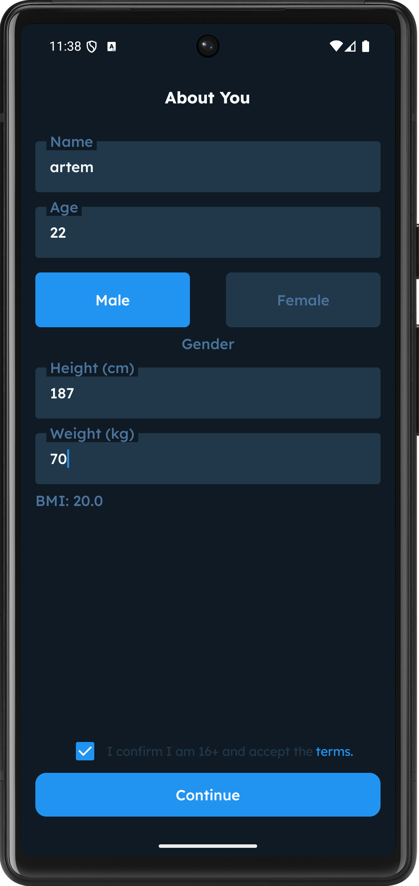
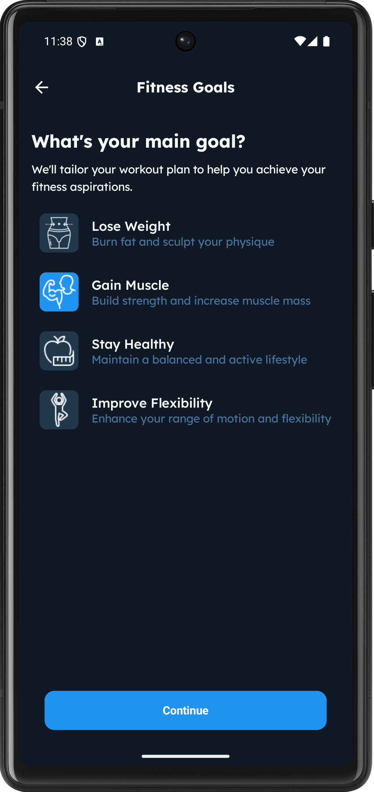
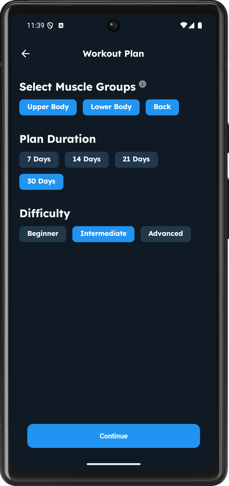
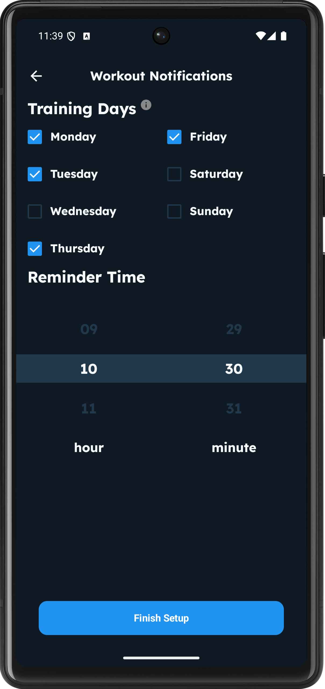
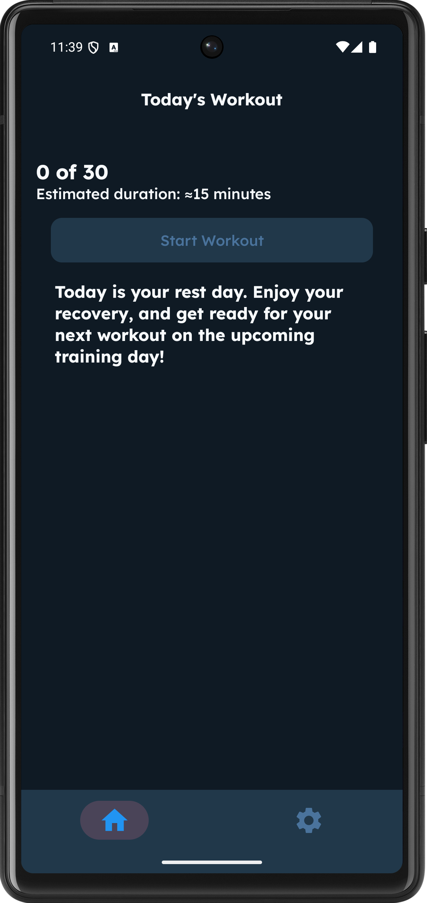
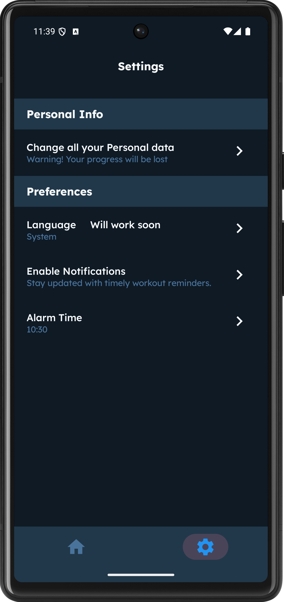
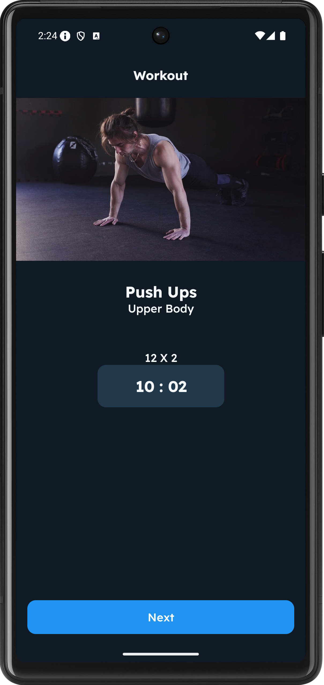

# 💪 Fitly - Personal Fitness Planner

> _Your personal home fitness coach, always in your pocket!_

---

## 📱 Project Description

**Fitly** is a mobile application that generates a fully personalized workout plan based on:

- Age
- Gender
- Height
- Weight
- Fitness goals
- Selected muscle groups
- Training difficulty level

The app automatically builds your training plan with:

- Individual exercise sets
- Dynamic difficulty adjustments
- Daily training cycle management
- Rest days detection & control
- Data persistence using `SharedPreferences`
- Daily reminders via notifications

---

## Screenshots

| About You | Fitness Goals | Workout Plan |
|-----------|---------------|--------------|
|  |  |  |

| Notification | Today Workout | Settings | Workout |
|--------------|---------------|----------|
|  |  |  | 
---

## ⚙️ Tech Stack

- 🖥 **Android Studio (Kotlin + Jetpack Compose)**
- 🧭 **Navigation Compose (for screens navigation)**
- 🔀 **MVVM architecture**
- 🗃 **SharedPreferences (local data storage)**
- 🔔 **WorkManager (background notifications)**
- 📦 **Gson (data serialization)**
- 🔄 **StateFlow + Compose Lifecycle management**

---

## 📂 Project Structure

- `view/` — UI components and screens
- `viewmodel/` — ViewModel business logic layer
- `model/` — Data classes (User, Exercises, Generator, etc.)
- `navigation/` — Screens navigation management
- `worker/` — Background worker for notifications
- `sharedpreferences/` — Serialization for persistent local data

---

## 🔥 Main Features

- Smart workout plan generator based on personal data.
- Dynamic difficulty adjustment for each training.
- Full user data saving and loading via SharedPreferences.
- Daily workout reminders (notifications even after device restarts).
- Prevents double workouts in the same day.
- Automatically rotates between selected muscle groups.
- English\Ukrainian language supported.
- Clean, simple and minimalistic user interface.

---

## 🌟 Future Features (Planned)

- 📊 **Training History:** activity tracking and calendar.
- 🏆 **Achievements:** motivational rewards system.
- 🤖 **AI-powered adaptation:** auto-adjust plan based on progress.
- 🔔 **More flexible reminders:** multiple daily notifications.
- ☁️ **Cloud sync:** Firebase/Supabase integration.
- 📈 **Analytics:** progress charts, statistics and insights.
- 👥 **Multi-user profiles:** separate profiles for family or friends.

---

## 🔗 Content Credits

Exercise video demonstrations used in this app are for educational and non-commercial purposes only.  
The videos were obtained from the following sources:

- [Video by Pavel Danilyuk](https://www.pexels.com/video/a-man-doing-push-ups-4367576/)
- [Video by Ketut Subiyanto](https://www.pexels.com/video/man-doing-tricep-dip-exercise-4804798/)
- [Video by Tima Miroshnichenko](https://www.pexels.com/video/man-doing-incline-push-ups-6388865/)
- [Video by Pavel Danilyuk](https://www.pexels.com/video/a-man-doing-push-ups-4367576/)
- [Video by Aliaksei Masiukevich](https://www.pexels.com/video/dynamic-indoor-fitness-routine-for-women-31035747/)
- [Video by Ron Lach](https://www.pexels.com/video/women-doing-aerobics-7928054/)
- [Video by ShotPot](https://www.pexels.com/video/man-sport-athlete-exercise-4110015/)
- [Video by Aliaksei Masiukevich](https://www.pexels.com/video/dynamic-plank-workout-for-core-strength-31035752/)
- [Video by Yan Krukau](https://www.pexels.com/video/person-doing-tiptoe-8480443/)
- [Video by Pavel Danilyuk](https://www.pexels.com/video/a-man-doing-push-ups-4367576/)
- [Video by Aliaksei Masiukevich](https://www.pexels.com/video/dynamic-indoor-fitness-routine-for-women-31035747/)  

If any content owners wish their media to be removed, please contact me.

---

## 🙏 Special Thanks

**Author:** _Artem (who built the full project from scratch 💪🔥)_

---

⭐ If you like the project — feel free to ⭐ the repository!
